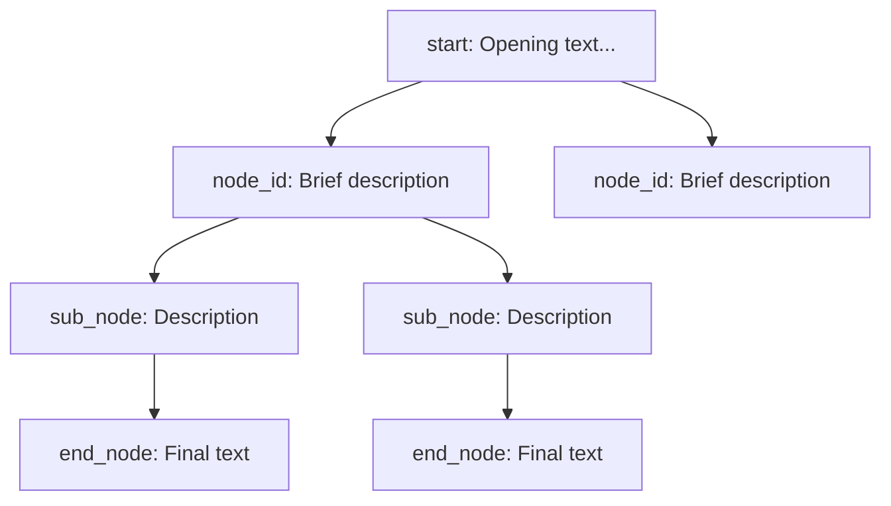
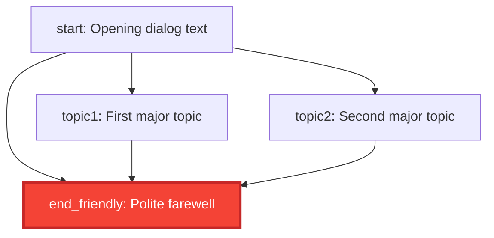
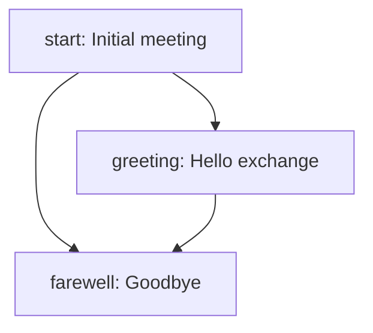

# Dialog Tree Visualization Guide

## Overview
This guide explains how to create and maintain Mermaid dialog tree diagrams for the RPG dialog system. Visual representations help understand conversation flow, identify missing connections, and plan dialog expansions.

## Mermaid Diagram Structure

### Basic Flowchart Template


### Node Naming Convention
- **UPPERCASE**: Mermaid node identifiers
- **lowercase_underscore**: Actual dialog node IDs from JSON
- **Format**: `MERMAID_ID[node_id: Brief description]`

## Color Coding System

### Predefined Styles
```mermaid
classDef startNode fill:#4CAF50,stroke:#2E7D32,stroke-width:3px,color:#fff
classDef endNode fill:#F44336,stroke:#C62828,stroke-width:3px,color:#fff
classDef questNode fill:#FF9800,stroke:#E65100,stroke-width:2px,color:#fff
classDef infoNode fill:#2196F3,stroke:#1565C0,stroke-width:2px,color:#fff
classDef actionNode fill:#9C27B0,stroke:#6A1B9A,stroke-width:2px,color:#fff
classDef tradeNode fill:#FF9800,stroke:#E65100,stroke-width:2px,color:#fff
classDef negotiateNode fill:#795548,stroke:#3E2723,stroke-width:2px,color:#fff
```

### Style Meanings
- 🟢 **Green (startNode)**: Entry points, starting conversations
- 🔴 **Red (endNode)**: Ending nodes with auto "End dialog" choice
- 🟠 **Orange (questNode)**: Quest offers, mission acceptance
- 🔵 **Blue (infoNode)**: Information gathering, lore, news
- 🟣 **Purple (actionNode)**: Character development, important choices
- 🟤 **Brown (negotiateNode)**: Payment, bargaining, deals
- 🟠 **Orange (tradeNode)**: Commerce, shopping, inventory

## File Organization

### Directory Structure
```
assets/dialogs/
├── characters.json
├── town_elder.json
├── town_elder_tree.md          # Dialog tree diagram
├── merchant.json
├── merchant_tree.md            # Dialog tree diagram
├── guard.json
├── guard_tree.md               # Dialog tree diagram
└── dialog_tree_guide.md        # This guide
```

### Naming Convention
- **Dialog File**: `character_name.json`
- **Tree Diagram**: `character_name_tree.md`
- **Consistent Naming**: Use same character identifier

## Creating New Dialog Trees

### Step 1: Analyze JSON Structure
1. Extract all node IDs from JSON file
2. Map choice targets to create connections
3. Identify end nodes (`"end": true`)
4. Note variable changes and conditions

### Step 2: Plan Diagram Layout
1. **Start Node**: Always at top
2. **Main Branches**: Primary conversation topics
3. **Sub-branches**: Detailed paths within topics
4. **End Nodes**: Clear terminals
5. **Cycles**: Conversations that loop back

### Step 3: Create Mermaid Code


### Step 4: Add Documentation
- **Legend**: Explain color coding
- **Key Paths**: Highlight important conversation routes
- **Variables**: List affected game variables
- **Special Features**: Note unique dialog mechanics

## Maintenance Guidelines

### When to Update Diagrams
- ✅ **New dialog nodes added**: Update connections
- ✅ **Choice targets changed**: Modify flow arrows
- ✅ **End nodes modified**: Update styling
- ✅ **New variables introduced**: Update documentation
- ✅ **Major dialog restructuring**: Rebuild diagram

### Validation Checklist
- [ ] All JSON nodes represented in diagram
- [ ] All choice targets have corresponding arrows
- [ ] End nodes properly styled
- [ ] No orphaned nodes (unreachable from start)
- [ ] No dead ends (except proper end nodes)
- [ ] Variable documentation matches JSON

## Advanced Features

### Conditional Paths
For choice conditions, add notes:
```mermaid
START --> CONDITIONAL[special_path: Requires level > 5]
```

### Variable Tracking
Document variable changes:
```mermaid
%% Variables: elder_trust +1, knows_prophecy = true
PROPHECY[ask_prophecy: Ancient knowledge discussion]
```

### Multiple Start Points
Some dialogs may have multiple entry points:
```mermaid
START1[start: First meeting]
START2[return_visit: Return conversation]
```

## Tools and Tips

### Mermaid Live Editor
- **URL**: https://mermaid.live/
- **Use**: Test diagrams before committing
- **Export**: Generate images for documentation

### GitHub Integration
- GitHub automatically renders Mermaid in markdown
- No additional setup required
- Diagrams visible in file preview

### VS Code Extensions
- **Mermaid Preview**: Live preview in editor
- **Mermaid Markdown Syntax**: Syntax highlighting

## Example Dialog Analysis

### From JSON to Diagram
```json
{
  "start": {
    "choices": [
      {"text": "Hello", "target": "greeting"},
      {"text": "Goodbye", "target": "farewell"}
    ]
  },
  "greeting": {
    "choices": [{"text": "Thanks", "target": "farewell"}]
  },
  "farewell": {
    "end": true
  }
}
```

Becomes:


This systematic approach ensures comprehensive, maintainable dialog visualizations that enhance the development and design process!