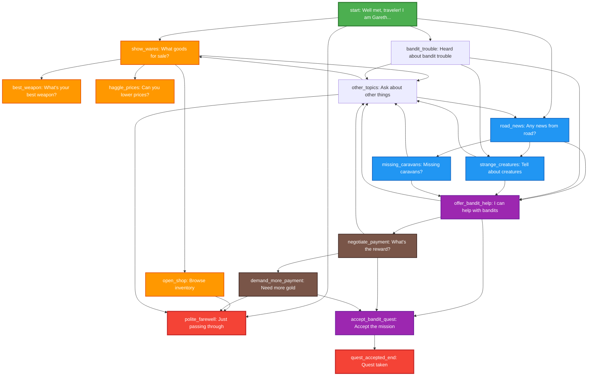

# Merchant Dialog Tree



## Legend
- 🟢 **Start Node**: Entry point (start)
- 🔴 **End Nodes**: Auto "End dialog" choice appears
- 🟠 **Trade Nodes**: Shopping and commerce
- 🔵 **News Nodes**: Road information and rumors
- 🟣 **Quest Nodes**: Mission offers and acceptance
- 🟤 **Negotiation Nodes**: Payment discussions

## Key Dialog Paths

### 🛒 **Shopping Path**
```
start → show_wares → open_shop → [END]
```

### 🗡️ **Quest Path (Direct)**
```
start → bandit_trouble → offer_bandit_help → accept_bandit_quest → quest_accepted_end
```

### 💰 **Negotiation Path**
```
start → road_news → offer_bandit_help → negotiate_payment → accept_bandit_quest → quest_accepted_end
```

### 📰 **Information Gathering Path**
```
start → road_news → strange_creatures → other_topics → show_wares
```

### 🤝 **Polite Exit Path**
```
start → polite_farewell → [END]
```

## Variables Affected
- `merchant_met`: Set to true at start
- `merchant_reputation`: Increases with positive interactions (0-3)
- `bought_items`: Set when shopping (placeholder)
- `heard_road_news`: Set when discussing road conditions
- `bandit_quest_from_merchant`: Set when accepting quest from merchant

## Special Features
- **Multiple Quest Entry Points**: Can reach bandit quest through different conversation paths
- **Circular Navigation**: `other_topics` allows returning to main conversation branches
- **Commerce Integration**: `open_shop` node ready for inventory system integration
- **Reputation System**: Merchant remembers player interactions through reputation variable