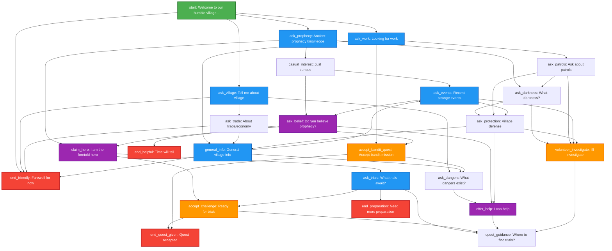

# Town Elder Dialog Tree



## Legend
- 🟢 **Start Node**: Entry point (start)
- 🔴 **End Nodes**: Auto "End dialog" choice appears
- 🟠 **Quest Nodes**: Accept missions/challenges
- 🔵 **Info Nodes**: Gather information
- 🟣 **Action Nodes**: Character development choices

## Key Dialog Paths

### 🗡️ **Hero's Journey Path**
```
start → ask_prophecy → claim_hero → ask_trials → accept_challenge → end_quest_given
```

### 🏹 **Bandit Quest Path**
```
start → ask_work → accept_bandit_quest → end_quest_given
```

### 🛡️ **Investigation Path**
```
start → ask_village → ask_dangers → offer_help → quest_guidance
```

### 📖 **Lore Discovery Path**
```
start → ask_prophecy → casual_interest → ask_events → ask_belief
```

## Variables Affected
- `met_elder`: Set to true at start
- `elder_trust`: Increases based on player choices (0-4)
- `knows_prophecy`: Set when discussing prophecy
- `bandit_quest_accepted`: Set when accepting bandit mission
- `trial_quest_given`: Set when accepting trial challenge
- `knows_trials`: Set when learning about trials