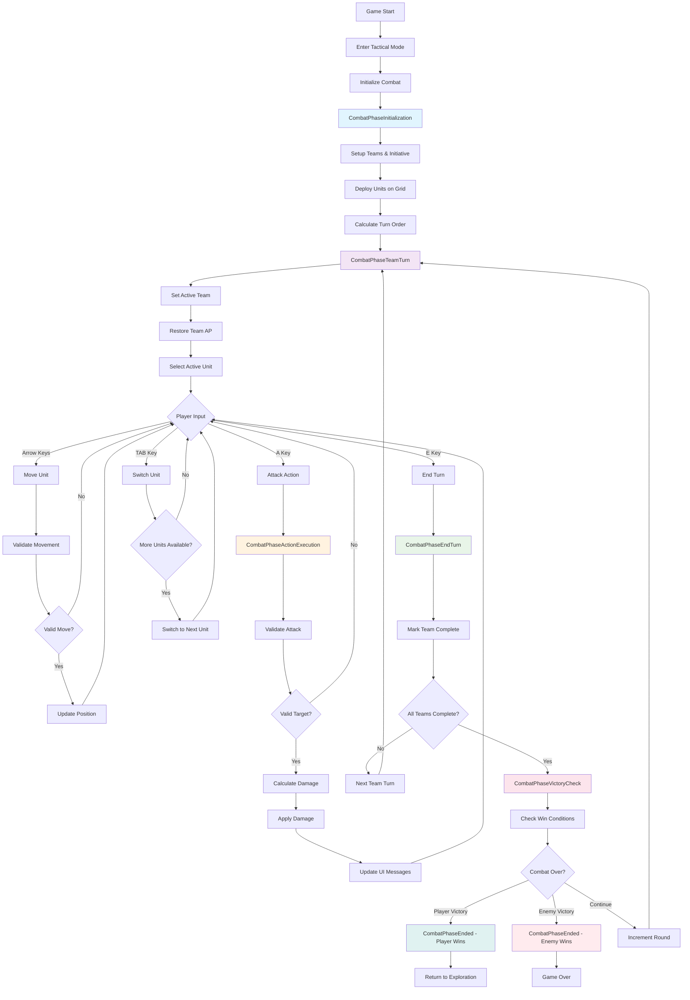

# Tactical Combat Flow Diagram

## Mermaid Flowchart



## ASCII Flow Diagram

```
┌─────────────────┐
│   Game Start    │
└─────────┬───────┘
          │
┌─────────▼───────┐
│ Enter Tactical  │
│     Mode        │
└─────────┬───────┘
          │
┌─────────▼───────────────────────────────────┐
│         INITIALIZATION PHASE                │
│ • Setup teams & initiative order           │
│ • Deploy units on grid                     │
│ • Calculate turn sequence                  │
└─────────┬───────────────────────────────────┘
          │
┌─────────▼───────────────────────────────────┐
│           TEAM TURN PHASE                   │
│ • Set active team & restore AP             │
│ • Select active unit                       │
│ • Handle player input:                     │
│   - Arrow Keys: Move unit                  │
│   - A Key: Attack action                   │
│   - E Key: End turn                        │
│   - TAB Key: Switch unit                   │
└─────────┬───────────────────────────────────┘
          │
          ├── Move ──┐
          │          │
          ├── Attack ─┼─► ACTION EXECUTION PHASE
          │          │   • Validate action
          │          │   • Calculate & apply effects
          │          │   • Update UI messages
          │          └─► Back to Team Turn
          │
          └── End Turn ──┐
                         │
┌────────────────────────▼─────────────────────┐
│            END TURN PHASE                    │
│ • Mark current team as complete             │
│ • Check if all teams finished round        │
│ • Switch to next team OR proceed to        │
│   victory check                             │
└─────────┬───────────────────────────────────┘
          │
┌─────────▼───────────────────────────────────┐
│          VICTORY CHECK PHASE                │
│ • Check win/lose conditions                │
│ • If combat continues: increment round     │
│ • If over: transition to ENDED phase       │
└─────────┬───────────────────────────────────┘
          │
     ┌────┴────┐
     │ Victory │ Defeat │ Continue
     ▼         ▼        ▼
┌─────────┐ ┌─────────┐ │
│ PLAYER  │ │  ENEMY  │ │
│ VICTORY │ │ VICTORY │ │
└─────────┘ └─────────┘ │
     │         │        │
     └─────────┼────────┘
               │ Loop back to
               │ TEAM TURN
               │ (new round)
```

## Phase Transitions & Callbacks

```
StateChangeCallback triggers on these transitions:

CombatPhaseInitialization ──► CombatPhaseTeamTurn
                                       │
                                       ▼
CombatPhaseActionExecution ◄── Player Input (Attack)
       │
       ▼
CombatPhaseTeamTurn ◄────────── Action Complete
       │
       ▼
CombatPhaseEndTurn ◄─────────── Player Press 'E'
       │
       ▼
CombatPhaseVictoryCheck
       │
       ├─► CombatPhaseEnded (if victory/defeat)
       │
       └─► CombatPhaseTeamTurn (if continue, new round)
```

## UI Updates Flow

```
Combat Phase Change
       │
       ▼ StateChangeCallback
Engine.updateMovementHighlighting()
       │
       ▼
Check if CombatPhaseTeamTurn
       │
       ▼
Get Active Player
       │
       ▼
Update Movement Range Display
       │
       ▼
UI Reflects Current Unit's Movement Options
```